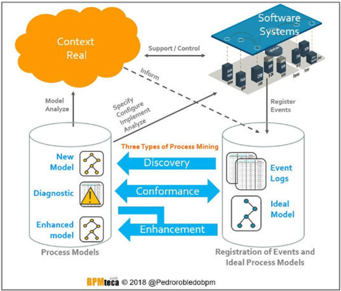
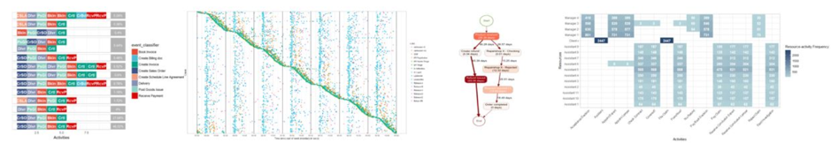
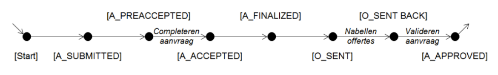
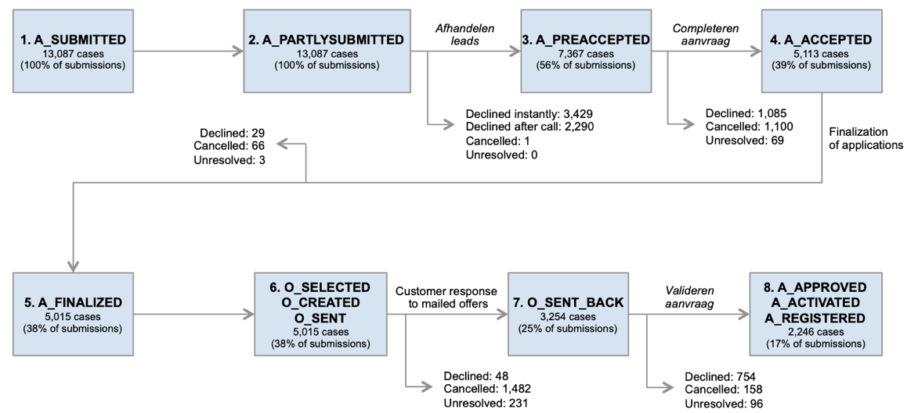
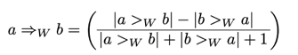

# Introduction

## Abstract <br>
* **The challenge** - Analyse and improve (using provided datasets) the loan application process. Design innovative ideas to conduct analysis and develop sound and executable business solutions to enhance the customer loan application experience. <br>
* **The data** - is a real life event log of the loan and overdraft approvals process from a bank. The log consists of 262,200 events and 13,087 cases. <br>
* **Event Log** - log is provided in XES format, the XES format is a standard defined by the IEEE task force on process mining.

## Business Process Mining
Process mining is one hot top which has attracted intense analysis in recent years and has a broad range of applications across different industries.  <br>
**Process Mining** is a process analysis method that aims to discover, monitor and improve real processes by extracting knowledge easily from available event logs in the systems of current information of an organization.


## Tooling — bupaR
   http://www.bupar.net/index.html <br>
**bupaR** is an open-source, integrated suite of R-packages for the handling and analysis of business process data. It currently consists of 8 packages, including the central package, supporting different stages of a process mining workflow. <br>


# Preparations {.tabset .tabset-fade .tabset-pills .tabset-funs}
## Load libraries
```{r message=FALSE, warning=FALSE, results='hide'}
library(bupaR)
library(edeaR)
library(processmapR)
library(processmonitR)
library(eventdataR)
library(readr)
library(tidyverse)
library(DiagrammeR)
library(ggplot2)
library(stringr)
library(lubridate)
library(heuristicsmineR)
library(petrinetR)
library(knitr)
library(Rmisc)
library(plotly)
```

## Load data
```{r load, message=FALSE, warning=FALSE, results='hide'}
set.seed(0)
events <- xesreadR::read_xes("./data/financial_log.xes")
```

## Global Vars & Funs
```{r varfuns, message=FALSE, warning=FALSE, results='hide'}
sample_var <- 0
anz_color1 <- "dodgerblue4"
anz_color2 <- "deepskyblue2"
```

# Understanding of the Data 
Overview of the eventlog data
```{r message=FALSE, warning=FALSE}
events
events <- events %>% mutate(resource_id = ifelse(is.na(resource_id), "000", resource_id))
```

Extract objects from Event Log
```{r message=FALSE, warning=FALSE}
cases <- events %>% cases()               # 13087 cases
activities <- events %>% activities()     # 24 unique activities
resources <- events %>% resources()       # 69 unique resources
traces <- events %>% traces()             # 4366 unique traces

n_cs <- nrow(cases)
cases$final_status <- ""
for (x in 1:n_cs) {
  if(regexpr("A_DECLINED",cases$trace[x]) > 0)
    cases$final_status[x] <- "DECLINED"
  else if(regexpr("A_CANCELLED",cases$trace[x]) > 0)
    cases$final_status[x] <- "CANCELLED"
  else if(regexpr("A_APPROVED",cases$trace[x]) > 0 | regexpr("A_REGISTERED",cases$trace[x]) > 0 | regexpr("A_ACTIVATED",cases$trace[x]) > 0)
    cases$final_status[x] <- "SUCCEED"
  else
    cases$final_status[x] <- "OTHER"
}
cat("There are ", nrow(cases), " cases; ", nrow(activities), " unique activities; ", nrow(resources), "  unique resources; ", nrow(traces), "  unique traces;")
```

## View at case level (A case represent a process of one loan application)
```{r message=FALSE, warning=FALSE}
kable(head(cases[cases$trace_length < 10,],5))
p1 <- 
cases %>% ggplot(mapping = aes(x = trace_length)) + geom_density() + geom_vline(aes(xintercept = mean(trace_length)),colour = anz_color1) + 
  labs(x = "Length of Trace", y = "",title = "Distribution of Trace Length") + theme_minimal() 
p2 <-
cases %>% ggplot(mapping = aes(x = number_of_activities)) + geom_density() + geom_vline(aes(xintercept = mean(number_of_activities)),colour = anz_color1) +
  labs(x = "Number of Activities", y = "",title = "Distribution of Activities Number") + theme_minimal() 

p3 <-
cases %>% filter(final_status != "OTHER") %>% ggplot(aes(x = factor(final_status), y = duration_in_days)) + geom_boxplot() +
  labs(x = "Final Status", y = "",title = "Boxplot of Duration in Days") + theme_minimal() 

p4 <- events %>%
    trace_length("log") %>%
    plot
multiplot(p1, p4, p2,p3, cols = 2)
```
```{r message=FALSE, warning=FALSE}
cat("The application process is always started with A_SUBMITTED, and can be end with 11 different activities, include A_DECLINED/A_CANCELLED/A_REGISTERED/")
```


## View at activity level
```{r message=FALSE, warning=FALSE}
activities <- activities %>% 
  mutate(act_type = ifelse(substr(activities$activity_id,1,2)  == "W_", 
                           "workItem",
                           ifelse(substr(activities$activity_id,1,2) == "A_",
                                  "application",
                                  ifelse(substr(activities$activity_id,1,2) == "O_",
                                         "offer",
                                         "other"))))
p1 <- 
activities %>% 
  ggplot(mapping = aes(x = activity_id, y = absolute_frequency, fill = act_type)) + 
  geom_bar(position = "dodge", stat = "identity") + 
  labs(x = "Activities", y = "Absolute Frequency", title = "View at avtivity level") +
  theme_minimal() +
  theme(axis.text.x = element_text(angle = 45, hjust = 1)) +
  scale_y_continuous(labels = scales::comma) + 
  geom_text(aes(label = absolute_frequency),vjust = 1.6, colour = "white", size = 2) +
  geom_vline(xintercept = c(3,4,5),colour = anz_color1, size = .5)

p2 <-
  activities %>% 
  filter(activity_id %in% c("A_APPROVED","A_CANCELLED","A_DECLINED")) %>% 
  ggplot(mapping = aes(x = activity_id, y = absolute_frequency)) + 
  geom_bar(position = "stack", stat = "identity", fill = anz_color1) +
  labs(x = "End states of applications", y = "Absolute Frequency", title = "Distribution of application final result") +
  theme_minimal() +
  scale_y_continuous(labels = scales::comma) + 
  geom_text(aes(label = absolute_frequency),vjust = 1.6, colour = "white", size = 4)

# multiplot(p1, p2,cols = 1)
p1
```

### Deep understanding of event type
**Application Events (A_)** <br>
Refers to states of the application itself. <br>
* A_SUBMITTED / A_PARTLYSUBMITTED - Initial application submission <br>
* A_PREACCEPTED - Application pre-accepted but requires additional information <br>
* A_ACCEPTED - Application accepted and pending screen for completeness <br>
* A_FINALIZED - Application finalized after passing screen for completeness <br>
* A_APPROVED / A_REGISTERED / A_ACTIVATED - End state of successful (approved) applications <br>
* A_CANCELLED / A_DECLINED - End states of unsuccessful applications <br>
<br>
**Offer Events (O_)** <br>
Refers to states of an offer communicated to the customer. <br>
* O_SELECTED - Applicant selected to receive offer <br>
* O_PREPARED / O_SENT - Offer prepared and transmitted to applicant <br>
* O_SENT BACK - Offer response received from applicant <br>
* O_ACCEPTED - End state of successful offer <br>
* O_CANCELLED / O_DECLINED - End states of unsuccessful offers <br>
<br>
**Work item Events (W_)** <br>
Refers to states of work items that occur during the approval process.These events capture most of the manual effort exerted by Bank’s resources during the application approval process. The events describe efforts during various stages of the application process.  <br>
* W_Afhandelen leads - Following up on incomplete initial submissions <br>
* W_Completeren aanvraag - Completing pre-accepted applications <br>
* W_Nabellen offertes - Follow up after transmitting offers to qualified applicants <br>
* W_Valideren aanvraag - Assessing the application <br>
* W_Nabellen incomplete dossiers - Seeking additional information during assessment phase <br>
* W_Beoordelen fraude - Investigating suspect fraud cases <br>
* W_Wijzigen contractgegevens - Modifying approved contracts <br>
<br>

**Names and Descriptions of Transitions in the Work Item Life Cycle**
* SCHEDULE - Indicates a work item has been scheduled to occur in the future
* START - Indicates the opening / commencement of a work item
* COMPLETE - Indicates the closing / conclusion of a work item

## View at resource level 
Each resource_id represent an employee who involved in the application process. Resource 53 works very hard, seems like it's a robot.
```{r message=FALSE, warning=FALSE}
p1 <-
resources %>% filter(absolute_frequency > 7000) %>% 
  ggplot(mapping = aes(x = resource_id, y = absolute_frequency)) + 
  geom_bar(position = "dodge", stat = "identity", fill = anz_color1) + 
  labs(x = "Resources", y = "Absolute Frequency", title = "View at resource level") +
  theme_minimal() +
  scale_y_continuous(labels = scales::comma) + 
  geom_text(aes(label = absolute_frequency),vjust = 1.6, colour = "white", size = 3)

p2 <-
events %>% filter(resource_id == 53, activity_id %in% c("A_SUBMITTED","A_PARTLYSUBMITTED","W_Afhandelen leads","W_Completeren aanvraag","A_DECLINED","A_CANCELLED")) %>%
  ggplot(mapping = aes(x = activity_id)) + geom_bar(fill = anz_color1) + 
  labs(x = "Activities", y = "Absolute Frequency", title = "Activity Distribution of Resource 53") +
  theme_minimal() +
  theme(axis.text.x = element_text(angle = 45, hjust = 1))

multiplot(p1, p2,cols = 2)

```

## View at trace level
```{r message=FALSE, warning=FALSE}
cat("There are ", nrow(traces), "unique traces; Let's look at the most frequent ones. (coverage = 50%)")
cat("26.2% applications are declined directly; 14.3% applications are declined beacuse the applicant can't(or not able to) complete the online application")
trace_exp <- events %>%
  trace_explorer(coverage = 0.5, show_labels = F)
trace_exp
```


# Understanding the Process in Detail
## The whole process map
The process looks dizzying。
```{r message=FALSE, warning=FALSE}
events %>% process_map()
```


## Process at application level
Let's only look at the process at application level:
```{r message=FALSE, warning=FALSE}
events %>% filter_activity(c("A_SUBMITTED","A_PARTLYSUBMITTED","A_DECLINED","A_PREACCEPTED","A_ACCEPTED","A_FINALIZED","A_CANCELLED","A_ACTIVATED","A_APPROVED","A_REGISTERED")) %>%
  process_map()
```
From the above diagram we can know: <br>
* A_PARTLYSUBMITTED is redundant of A_SUBMITTED <br>
* A_ACTIVATED, A_APPROVED, A_REGISTERED are redundant <br>
* Total cases (13087) = 2807(A_CANCELLED) + 2246(A_Succeed) + 7635(A_DECLINED) + 69(A_PREACCEPTED) + 3(A_ACCEPTED) + 327(A_FINALIZED) <br>
* Identified the standard case flow for approved Application is <br>



Then, we can simplify the process map as below:
```{r message=FALSE, warning=FALSE}
events %>% filter_activity(c("A_SUBMITTED","A_PARTLYSUBMITTED","A_DECLINED","A_PREACCEPTED","A_ACCEPTED","A_FINALIZED","A_CANCELLED","A_ACTIVATED","A_APPROVED","A_REGISTERED")) %>%
  act_collapse(A_Success = c("A_ACTIVATED","A_APPROVED","A_REGISTERED"),
               A_SUBMITTED = c("A_SUBMITTED","A_PARTLYSUBMITTED")) %>%
  process_map()
```

The following diagram clearly shows the direct relationship betweeb two activities 
```{r message=FALSE, warning=FALSE}
events %>% filter_activity(c("A_SUBMITTED","A_PARTLYSUBMITTED","A_DECLINED","A_PREACCEPTED","A_ACCEPTED","A_FINALIZED","A_CANCELLED","A_ACTIVATED","A_APPROVED","A_REGISTERED")) %>%
  precedence_matrix(type = "absolute") %>% plot()
```

## Declined case 
Now, I will deep dive into the declined cases, to discover the reasons of decline. From the above chart, we can know 5719 out of 7635 cases are declined immediately right after submission online. <br>
Let's check the other declined cases:
```{r message=FALSE, warning=FALSE}
events_declined <- 
events %>% 
  filter_activity(c("A_PARTLYSUBMITTED","A_DECLINED","A_PREACCEPTED","A_ACCEPTED","A_FINALIZED","W_Afhandelen leads","W_Completeren aanvraag",
                    "W_Nabellen offertes","W_Valideren aanvraag","W_Nabellen incomplete dossiers","W_Beoordelen fraude","W_Wijzigen contractgegevens")) %>%
  filter_trim(start_activities = "A_PARTLYSUBMITTED",end_activities = c("A_DECLINED"))
events_declined %>% process_map(type = frequency())
```
From the above chart, we know: <br>
* 2234 was declined after 'W_Afhandelen leads' (Following up on incomplete initial submissions) <br>
* 25 was declined after 'A_ACCEPTED' <br>
* 57 was declined after 'W_Beoordelen fraude' (Investigating suspect fraud cases) <br>
* 1088 was declined after W_Completeren aanvraag (Completing pre-accepted applications) <br>
* 86 was declined after W_Nabellen incomplete dossiers (Seeking additional information during assessment phase) <br>
* 668 was declined after W_Valideren aanvraag (Assessing the application) <br>
* 48 was declined after W_Nabellen offertes (Follow up after transmitting offers to qualified applicants) <br>

In General, we can get the following chart to clearly show the applications final status - only 2246 out of 13087 got succeed.
```{r message=FALSE, warning=FALSE}
x <- list("Total","CANCELLED","PREACCEPTED","Direct_Decline","Incomplete","Suspect_fraud","Completeren","Nabellen","Assessing","Qualified","ACCEPTED","Succeed")
measure <- c("Total","relative","relative","relative","relative","relative","relative","relative","relative","relative","relative","relative")
text <- c("13087","-2807","-399","-3429","-2234","-57","-1088","-86","-668","-48","-25","2246")
y <- c(13087,-2807,-399,-3429,-2234,-57,-1088,-86,-668,-48,-25,-2246)
wf_data <- data.frame(x=factor(x,levels = x),measure,text,y)

p <- plot_ly(
  wf_data, name = "20", type = "waterfall", measure = ~measure,
  x = ~x, textposition = "outside", y= ~y, text =~text,
  connector = list(line = list(color= "rgb(63, 63, 63)"))) %>%
  layout(title = "Applications final status",
         xaxis = list(title = ""),
         yaxis = list(title = ""),
         autosize = TRUE,
         showlegend = TRUE)
p
```

Also we can generate the following diagram of key process steps and distribution of application volume


# Heuristics Miner
**Heuristics Miner** is an algorithm that acts on the Directly-Follows Graph, providing way to handle with noise and to find common constructs (dependency between two activities, AND). The output of the Heuristics Miner is an Heuristics Net, so an object that contains the activities and the relationships between them.  <br>

## Mining of the dependency graph
A frequency based metric is used to indicate how certain that there is truly a dependency relation between two events/activities A and B (notation A ⇒W B). Let W be an event log over T, and a, b ∈ T. Then |a >W b| is the number of times a >W b occurs in W, and: <br>

An sample to explain the mathematical formula <br>
If we use this definition in the situation that, in 5 traces, activity A is directly followed by activity B but the other way around never occurs, the value of A ⇒W B = 5/6 = 0.833 indicating that we are not completely sure of the dependency relation (only 5 observations possibly caused by noise). <br>
However if there are 50 traces in which A is directly followed by B but the other way around never occurs, the value of A ⇒W B = 50/51 = 0.980 indicates that we are pretty sure of the dependency relation. <br>

Dependency graph of application process
```{r message=FALSE, warning=FALSE}
dependency_matrix(events,threshold = .9) %>% render_dependency_matrix()
```

Causal graph / Heuristics net
```{r message=FALSE, warning=FALSE}
causal_net(events) %>% render_causal_net()
```

# Conclusions
Through comprehensive analysis of the event log, we managed to convert a data set containing 262,200 events and 13,087 cases into a clearly interpretable, end-to-end workflow for a loan and overdraft approvals process. I suggest the improvements: <br>
* 1. Simplify the process by removing reduntant activities, e.g. A_SUBMITTED / A_PARTLYSUBMITTED; A_APPROVED / A_REGISTERED / A_ACTIVATED; O_PREPARED / O_SENT; <br>
* 2. Totally there are 4366 traces, from the trace explorer, 50% of the traces are covered by 12 types, and longest one which contains only 14 activities. There are space to optimize the process. <br>
* 3. Refine the automation assessment process after submitting application online; Totally 58% cases are declined, 44% are directly declined. <br>
* 4. Duration_in_days of declined application is 2.0 days, however the duration_in_days of succeed and cancelled application is 16.7/18.5 days.


